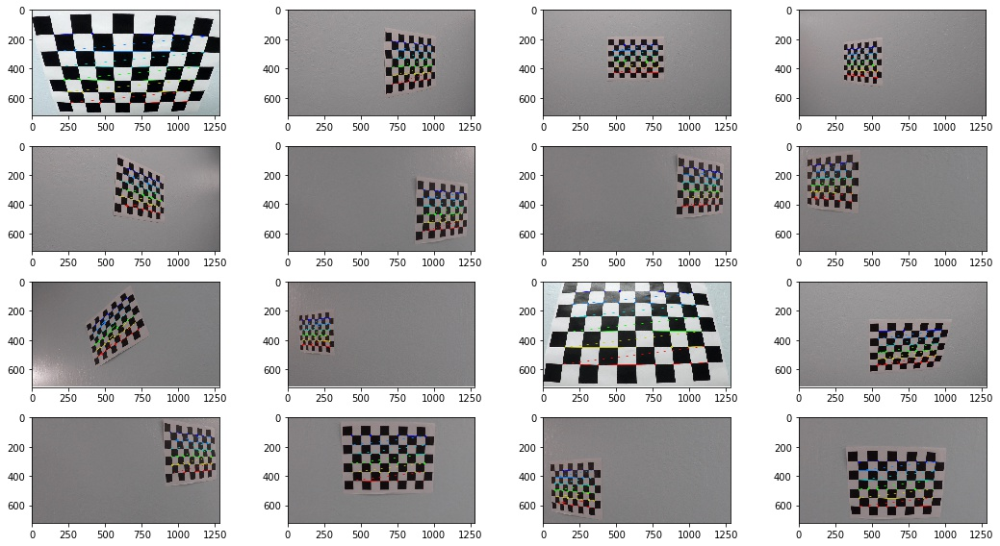
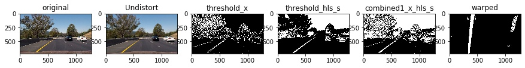
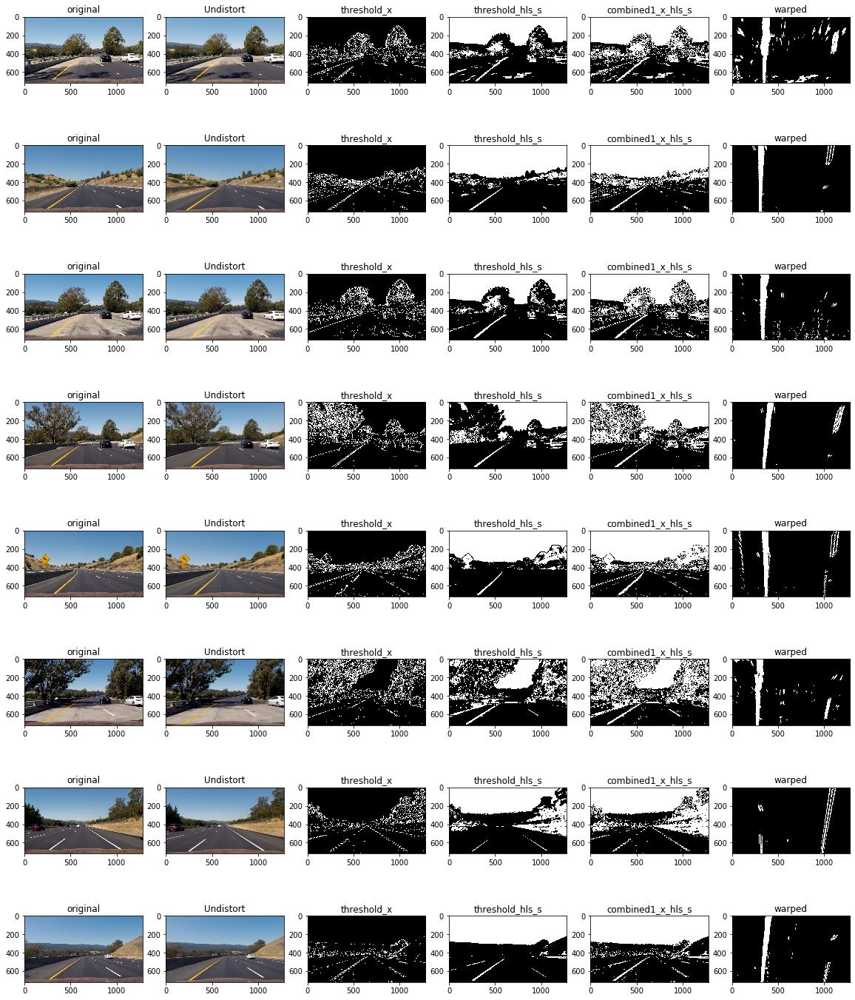
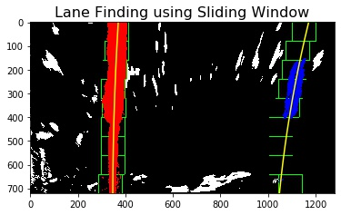
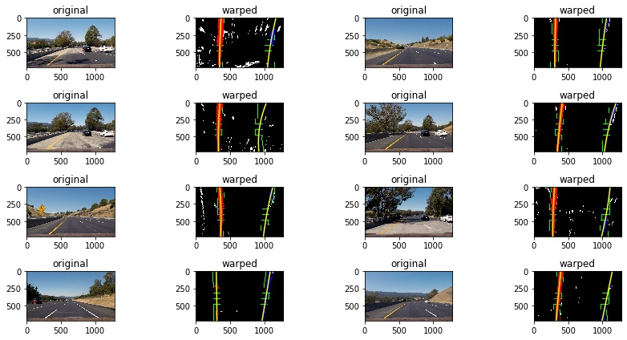
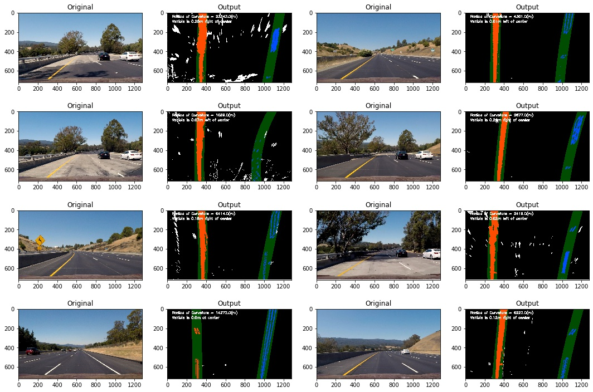

# Advance Lane Lines

> Steps
* Compute the camera calibration matrix and distortion coefficients given a set of chessboard images
* Apply a distortion correction to raw images
* Use color transforms, gradients, etc., to create a thresholded binary image
* Apply a perspective transform to rectify binary image ("birds-eye view")
* Detect lane pixels and fit to find the lane boundary
* Measure Curvature

---
## Camera Calibration
Camera introduces two types of distortation:
* Radial Distortion
    * Real cameras use curved lenses to form an image, and light rays often bend a little too much or too little at the edges of these lenses. This creates an effect that distorts the edges of images, so that lines or objects appear more or less curved than they actually are. This is called radial distortion, and it’s the most common type of distortion.
* Tangential Distortion
    * This occurs when a camera’s lens is not aligned perfectly parallel to the imaging plane, where the camera film or sensor is. This makes an image look tilted so that some objects appear farther away or closer than they actually are.
    
* Distortion can be corrected with following Coefficients and Correction
    * radial distortion: k1, k2, and k3
    * tangential distortion: p1 and p2
    
Following process explains Calibration Steps

> Get Object Points  
objp = np.zeros((6*9, 3), np.float32)  
mat = np.mgrid[0:9, 0:6]  
mat = mat.T  
mat = mat.reshape(-1, 2)  
objp[:, :2] = mat   

> Image Points  
gray = cv2.cvtColor(image, cv2.COLOR_BGR2GRAY)  
ret, corners = cv2.findChessboardCorners(gray, (nx, ny), None)  
imgpoints.append(corners)  
objpoints.append(objp)  

 
*Calibrated Images*

---
## Undistort Images
> Calibrate to calculate distortion coefficients  
ret, mtx, dist, rvecs, tvecs = cv2.calibrateCamera(objpoints, imgpoints, image_size, None, None)  
*save mtx and dist to be used later for all images  

>  Test undistortion on an image  
undist = cv2.undistort(image, mtx, dist, None, mtx)  

 
*Calibrated Undistorted Images*

---
## Test Images

 
*Test Images*

---
## Test Images - Undistorted

 
*Test Images Undistorted*

---
## Craete Perspective Transform - Warp Image
> Transform Perspective  
img_size = w, h = img.shape[1], img.shape[0] 

#w, h = 1280, 720
src= [[270, 674], [530, 494], [726, 494], [1044, 672]]
dst = [[300, h], [300, 0], [w-300, 0], [w-300, h]]

src = np.float32(src)
dst = np.float32(dst)
    
M = cv2.getPerspectiveTransform(src, dst)
Minv = cv2.getPerspectiveTransform(dst, src)  

warped = cv2.warpPerspective(img, M, img_size, flags=cv2.INTER_LINEAR)  
unperspective = cv2.warpPerspective(warped, Minv, img_size, flags=cv2.INTER_LINEAR)

---
## Create Binary Threshold Image
image = undistort(image)
image = gaussian_blur(image, ksize=5)

*Threshold Gradient*
binary_x = threshold_x(image, ksize=3, thresh=(20, 100))
binary_mag = threshold_mag(image, ksize=3, thresh=(40, 100))
binary_dir = threshold_dir(image, ksize=15, thresh=(0.7, 1.3)) 

*Threshold HLS*
binary_hls_s = threshold_hls(image, thresh=(80, 255))

*Combine two binary thresholds*
q = (binary_x==1) | (binary_hls_s==1)
binary_combined_1 = np.zeros_like(binary_x)
binary_combined_1[q] = 1

  
*Sample Threshold Binary Image*

  
*Sample Threshold and Warped Binary Image*

  
*Test Images Threshold and Warped*

---
## Detect lane pixels and fit to find the lane boundary  
* The process of sliding window to detect the lane pixels is explained below:  

*Histogram of the bottom half of the image*
h, w = image.shape[0], image.shape[1]    
half_image = image[h//2:, :]
histogram = np.sum(half_image, axis=0)

*Output image to draw on and  visualize the result*
out_img = np.dstack((image, image, image)) * 255 

*histogram peaks and left/right lanes*
mid = histogram.shape[0] // 2 
leftx_base = np.argmax(histogram[150:mid]) + 150 # No need to start search from 0
rightx_base = np.argmax(histogram[mid+200:-100]) + mid+200 #  # No need to go beyond 

*Hyperparameters*
nwindows = 9 
margin = 50 
minpix = 50  
window_height = h // nwindows

  
*Sample Image with Lane Finding*

  
*Test Images with Lane Finding*

---
## Skip the sliding windows

  
*Sample Test Image with Lane Finding*

  
*Test Images with Lane Finding*

## Measure Curvature

> Define conversions in x and y from pixels space to meters  
ym_per_pix = 30/720 # meters per pixel in y dimension  
xm_per_pix = 3.7/700 # meters per pixel in x dimension  
left_fitx = [lx * xm_per_pix for lx in left_fitx]  
right_fitx = [rx * xm_per_pix for rx in right_fitx]  
ploty = [py * ym_per_pix for py in ploty]  
left_fit = np.polyfit(ploty, left_fitx, 2)  
right_fit = np.polyfit(ploty, right_fitx, 2)  
y_eval = np.max(ploty)  
y_eval = y_eval * ym_per_pix  
A, B, C = left_fit[0], left_fit[1], left_fit[2]  
left_curverad = (((1 + (2 * A * y_eval + B)**2))**1.5) / np.absolute(2*A)    
A, B, C = right_fit[0], right_fit[1], right_fit[2]  
right_curverad = (((1 + (2 * A * y_eval + B)**2))**1.5) / np.absolute(2*A)  

## Measure Centre  

> Consider last 20 Points  
left_fitx = left_fitx[-20:]  
right_fitx = right_fitx[-20:]  
ploty = ploty[-20:]  
diff = [l + (r - l)/2 for r, l in zip(right_fitx, left_fitx)]  
x = np.mean(diff)  
y = np.mean(ploty)  
cx, cy = int(x), int(y)  

  
*Test Images with Lane Finding and Centre and Curvature*  

---
# Process Input  
> Complete Pipeline for processing image in Video  

  
*Sample Test Image Output with Lane Finding and Centre and Curvature*  

  
*Test Images Output with Lane Finding and Centre and Curvature*  

---
# Input and Final Output  

Input: [Project Video](data/project_video.mp4)  

Output: [Project Video Marked](data/output_images/project_video_marked.mp4)  

---
# Discussion
Setting up of correct Craete Perspective Transform to create Warp Image was the most challenging due to the fact that even small mistake has large impact. The first criteria is to select image points from an image that has straight lanes and avoid image that have curved lanes. After selecting source points from the image, we need to choose the right destination points. Since our selected points form trapezoidal, we need to convert these points such that these form rectangle. I used 300 as offset from the boundaries for the destination points uisng below source and destination:

w, h = 1280, 720
src= [[270, 674], [530, 494], [726, 494], [1044, 672]]
dst = [[300, h], [300, 0], [w-300, 0], [w-300, h]]

The second most challenging point was to identify peak of histogram. Since histogram may show few peaks for non-lane boundaries, so instead of starting search from beginning, it is better to search from x-value 150 to mid point for left lane and midpoint+200 to until -100 from end for right pixels. This ensured that lanes will not be searched extreme left and right lane sometimes.

The third challenging point is threshold image, combining threshold such that lane is detected either from sobel_x or HLS_S works best.

The final learning is to use global variable in processing image in order to save the last frame left and right points so that the same points can be used when the lanes are not detected in the next frame.

This can further be improved by adding more restrictions based on lane propoerties. In case lane not detected according to defined properties, the lane points from the previous frames can be used untill few frames.
