# Advance Lane Lines
> Steps
* Compute the camera calibration matrix and distortion coefficients given a set of chessboard images
* Apply a distortion correction to raw images
* Use color transforms, gradients, etc., to create a thresholded binary image
* Apply a perspective transform to rectify binary image ("birds-eye view")
* Detect lane pixels and fit to find the lane boundary
* Measure Curvature

---
## Compute the camera calibration matrix and distortion coefficients given a set of chessboard images
Camera introduces two types of distortation:
* Radial Distortion
    * Real cameras use curved lenses to form an image, and light rays often bend a little too much or too little at the edges of these lenses. This creates an effect that distorts the edges of images, so that lines or objects appear more or less curved than they actually are. This is called radial distortion, and it’s the most common type of distortion.
* Tangential Distortion
    * This occurs when a camera’s lens is not aligned perfectly parallel to the imaging plane, where the camera film or sensor is. This makes an image look tilted so that some objects appear farther away or closer than they actually are.
    
* Distortion can be corrected with following Coefficients and Correction
    * radial distortion: k1, k2, and k3
    * tangential distortion: p1 and p2
    
In order to calibrate camera, following 20 images were used.
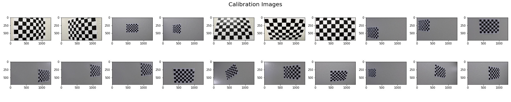 
*Calibration Images for Object Points for 9 inside corners on x-axis and 6 inside corners on y-axis with z-value zero *

Following process explains Calibration Steps

> Get Object Points  
objp = np.zeros((6*9, 3), np.float32)  
mat = np.mgrid[0:9, 0:6]  
mat = mat.T  
mat = mat.reshape(-1, 2)  
objp[:, :2] = mat   

> Image Points  
gray = cv2.cvtColor(image, cv2.COLOR_BGR2GRAY)  
ret, corners = cv2.findChessboardCorners(gray, (nx, ny), None)  
imgpoints.append(corners)  
objpoints.append(objp)  

> Calibrate to calculate distortion coefficients  
ret, mtx, dist, rvecs, tvecs = cv2.calibrateCamera(objpoints, imgpoints, image_size, None, None)  
*save mtx and dist to be used later for all images  

>  Test undistortion on an image  
undist = cv2.undistort(image, mtx, dist, None, mtx)  

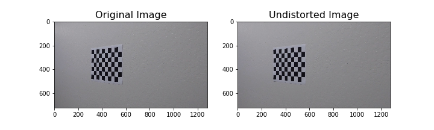  
*Sample Undistorted Image*

> Transform Perspective  
gray = cv2.cvtColor(undist, cv2.COLOR_BGR2GRAY)  
ret, corners = cv2.findChessboardCorners(gray, (nx, ny), None)  

> Get Source Points from Corners  
top_left, top_right = corners[0], corners[nx-1]  
bottom_right, bottom_left = corners[-1], corners[-nx]  
src = np.float32([top_left, top_right, bottom_right, bottom_left])  

> Get Destination Points from Image with offset e.g. 300  
top_left, top_right = [offset, offset], [image_size[0] - offset, offset]    
bottom_right = [image_size[0] - offset, image_size[1] - offset]    
bottom_left = [offset, image_size[1] - offset]  
dst = np.float32([top_left, top_right, bottom_right, bottom_left])  

> Perspective transform matrix  
M = cv2.getPerspectiveTransform(src, dst)

> Get Warped Image  
warped = cv2.warpPerspective(undist, M, image_size)  

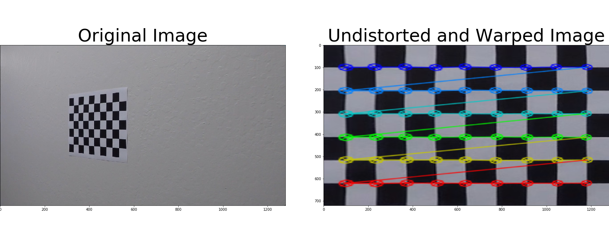  
*Sample Undistorted and Warped Image*  

---
## Apply a distortion correction to raw images

> Process to Undistort Images  
dist_pickle = pickle.load(open(dist_fname, 'rb'))  # Load Calibration Params    
mtx = dist_pickle['mtx']  
dist = dist_pickle['dist']  
image = cv2.undistort(image, mtx, dist, None, mtx) # Undistort  Images  

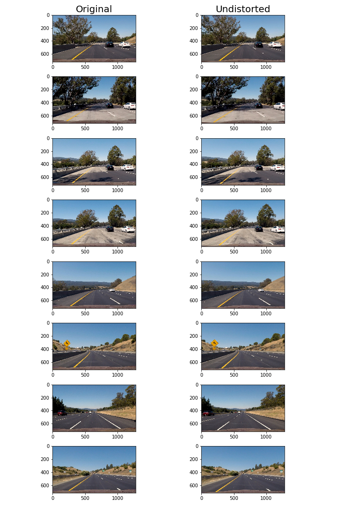  
*Images Undistorted*  

---
## Use color transforms, gradients, etc., to create a thresholded binary image.
* Process steps to create thresholded binary images are below

> Undistort Image  
image = cv2.undistort(image, mtx, dist, None, mtx)   

> Threshold R color channel to get R Binary with (200, 255)  
R = image[:,:,0]  
R_binary = np.zeros_like(R)  
R_binary[(R >= R_thresh[0]) & (R <= R_thresh[1])] = 1  

> Threshold color channel with (170, 255) to get s_binary  
hls = cv2.cvtColor(image, cv2.COLOR_RGB2HLS)  
s_channel = hls[:, :, 2]  
s_binary = np.zeros_like(s_channel)  
s_binary[(s_channel >= s_thresh[0]) & (s_channel <= s_thresh[1])] = 1  

> Threshold x gradient with (20, 100) to get sx_binary  
l_channel = hls[:, :, 1]  
\# Apply Sobel x  
sobelx = cv2.Sobel(l_channel, cv2.CV_64F, 1, 0)  
sobelx_abs = np.absolute(sobelx)  
scale_factor = np.max(sobelx_abs) / 255  
scaled_sobel = np.uint8(sobelx_abs/scale_factor)  
\# Threshold x gradient  
sx_binary = np.zeros_like(scaled_sobel)  
sx_binary[(scaled_sobel >= sx_thresh[0]) & (scaled_sobel <= sx_thresh[1])] = 1   

> Activate binary image when any two activated from R_binary, s_binary, or sx_binary  
combined_binary = np.zeros_like(sx_binary)  
opt1 = (s_binary == 1) & (sx_binary == 1)  
opt2 = (sx_binary == 1) & (R_binary == 1)    
opt3 = (s_binary == 1) & (R_binary == 1)  
opt = opt1 | opt2 | opt3  
combined_binary[opt] = 1   

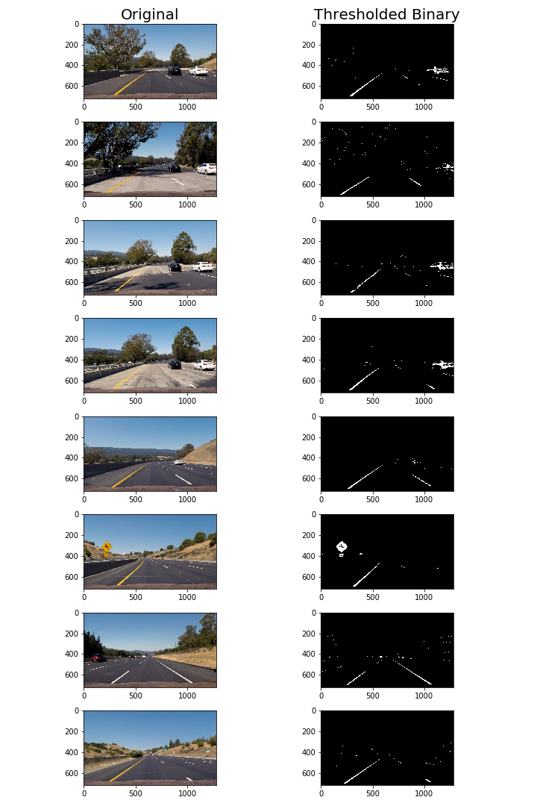  
*Threshold Binary Images*  

## Apply a perspective transform to rectify binary image ("birds-eye view").  
* Process to rectify the binary image to get birds-eye view is below:  

> Get Binary Thresholded Image  
combined_binary[opt] = 1 # continue from previous step  
w, h = binary_img.shape[1], binary_img.shape[0]  
image_size = (w, h)  

> get source points - grabbing ROI as marked in the below image  
top_left = [595, 450]  
top_right = [685, 450]  
bottom_right = [1210, h]  
bottom_left = [200, h]  
src = np.float32([top_left, top_right, bottom_right, bottom_left])  

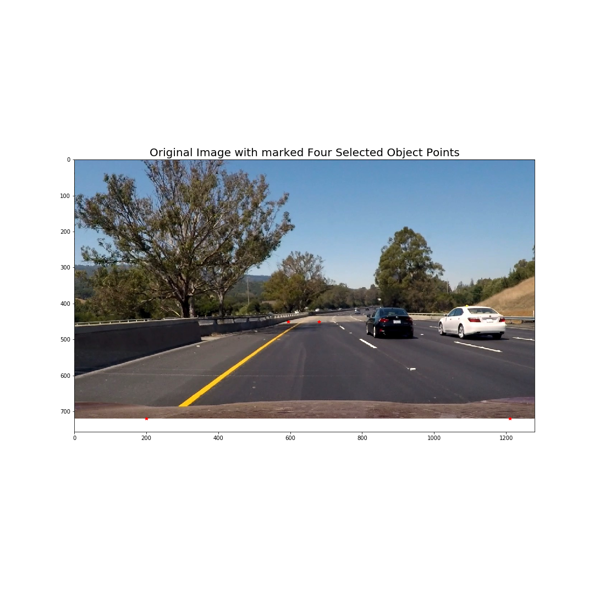  
*Object Points Marked on Sample Image with Red Star for Bird-Eye View*  

> get destination points  
offset = 300  
top_left = [offset, 0]  
top_right = [w - offset, 0]  
bottom_right = [w - offset, h]  
bottom_left = [offset, h]  
dst = np.float32([top_left, top_right, bottom_right, bottom_left])  

> get perspective transform matrix and warped image as shown below  
M = cv2.getPerspectiveTransform(src, dst)  
warped = cv2.warpPerspective(binary_img, M, image_size, flags=cv2.INTER_LINEAR)  

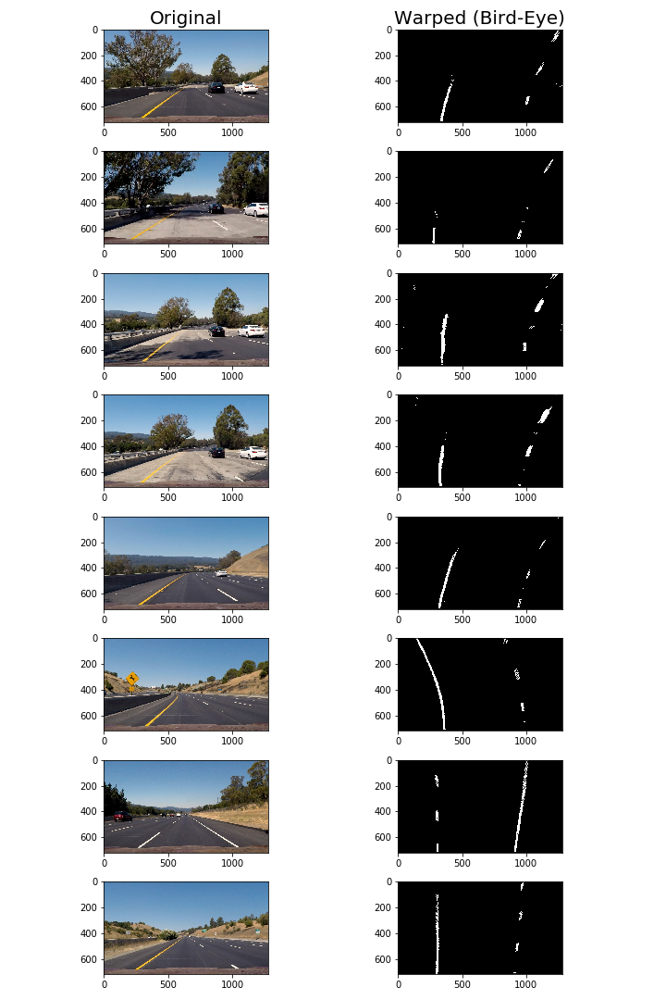  
*Threshold Binary Warped Images by applying prespective transform M in Bird-Eye View*  

---
## Detect lane pixels and fit to find the lane boundary  
* The process of sliding window to detect the lane pixels is explained below:  

> Find Left and Right Lane Pixels  

> Start with Binary Warped Image and Prespective Transform M   
Get binary_warped, M  

> Create Histogram  
h, w = binary_warped.shape[0], binary_warped.shape[1]  
half_image = binary_warped[h//2:, :]  
histogram = np.sum(half_image, axis=0)  

> histogram peaks and left/right lanes  
mid = histogram.shape[0] // 2  
leftx_base = np.argmax(histogram[:mid])  
rightx_base = np.argmax(histogram[mid:]) + mid  

> Hyperparameters  
nwindows = 15  
margin = 150   
minpix = 50  
window_height = h // nwindows    

> x and y positions of all nonzero pixels    
nonzero = binary_warped.nonzero()  
nonzeroy = np.array(nonzero[0])  
nonzerox = np.array(nonzero[1])  

> Current Positions to be updated  
leftx_current = leftx_base  
rightx_current = rightx_base  
 
> left and right lane pixel indices  
left_lane_inds = []  
right_lane_inds = []  
 
for window in range(nwindows):  
    \# Identify window boundaries in x and y  
    
    win_y_high = h - window * window_height  
    win_y_low = h - (window + 1) * window_height  
     
    win_xleft_low = leftx_current - margin  
    win_xleft_high = leftx_current + margin  
     
    win_xright_low = rightx_current - margin  
    win_xright_high = rightx_current + margin  

    # Draw the windows on the visualization image  
     pt1 = (win_xleft_low, win_y_low)  
     pt2 = (win_xleft_high, win_y_high)  
     color = (0, 255, 0)  
     thickness = 2  
     cv2.rectangle(out_img, pt1, pt2, color, thickness)  
     
     pt1 = (win_xright_low, win_y_low)  
     pt2 = (win_xright_high, win_y_high)  
     cv2.rectangle(out_img, pt1, pt2, color, thickness)  

     # Identify the nonzero pixels in x and y within the window  
     left_inds = ((nonzeroy >= win_y_low) & (nonzeroy < win_y_high) & (nonzerox >= win_xleft_low) & (nonzerox < win_xleft_high))  
     good_left_inds = left_inds.nonzero()[0]  

     right_inds = ((nonzeroy >= win_y_low) & (nonzeroy < win_y_high) & (nonzerox >= win_xright_low) & (nonzerox < win_xright_high))  
     good_right_inds = right_inds.nonzero()[0]  
             
     # Append these indices to the lists  
     left_lane_inds.append(good_left_inds)  
     right_lane_inds.append(good_right_inds)  

     # If found > minpix pixels, recenter next window on their mean position  
     if len(good_left_inds) > minpix:  
         inds = nonzerox[good_left_inds]  
         leftx_current = np.int(np.mean(inds))  
         
     if len(good_right_inds) > minpix:  
         inds = nonzerox[good_right_inds]  
         rightx_current = np.int(np.mean(inds))  
    
\# Concatenate the arrays of indices (previously was a list of lists of pixels)  
left_lane_inds = np.concatenate(left_lane_inds)  
right_lane_inds = np.concatenate(right_lane_inds)  

\# Extract left and right line pixel positions  
leftx = nonzerox[left_lane_inds]  
lefty = nonzeroy[left_lane_inds]  
rightx = nonzerox[right_lane_inds]  
righty = nonzeroy[right_lane_inds]  

> Fit Polynomial for detected left and right lane points  
\# Fit a second order polynomial to each using `np.polyfit`  
left_fit = np.polyfit(lefty, leftx, 2)  
right_fit = np.polyfit(righty, rightx, 2)  

> Generate x and y values for plotting  
ploty = np.linspace(0, h-1, h)  
left_fitx = left_fit[0] * ploty\**2 + left_fit[1] * ploty + left_fit[2]  
right_fitx = right_fit[0] * ploty\**2 + right_fit[1] * ploty + right_fit[2]  

\# out image  
out_img = np.dstack((binary_warped, binary_warped, binary_warped)) * 255   

\# Colors in the left and right lane regions  
out_img[lefty, leftx] = [255, 0, 0]  
out_img[righty, rightx] = [0, 0, 255]  

\# Plots the left and right polynomials on the lane lines  
plt.plot(left_fitx, ploty, color='yellow')  
plt.plot(right_fitx, ploty, color='yellow')  

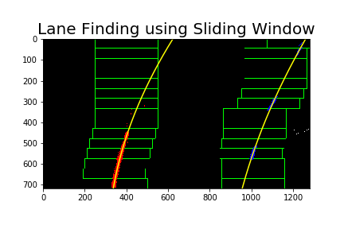  
*Lane Detection using Sliding Window*  

> Skip the Sliding Window    
Start with Polynomial Coefficients from the last image    
left_fit = np.array([2.85842284e-04, -5.92619909e-01, 6.14734010e+02])    
right_fit = np.array([1.80581319e-04, -5.51462989e-01, 1.25626613e+03])  

> Search the Activated around the current Poly  
margin = 50  

> Grab Activate Pixels    
nonzero = binary_warped.nonzero()    
nonzeroy = np.array(nonzero[0])  
nonzerox = np.array(nonzero[1])  
xvals = left_fit[0] * nonzeroy\**2 + left_fit[1] * nonzeroy + left_fit[2]    
left_lane_inds = (nonzerox > xvals - margin) & (nonzerox < xvals + margin)    
xvals = right_fit[0] * nonzeroy**2 + right_fit[1] * nonzeroy + right_fit[2]  
right_lane_inds = (nonzerox > xvals - margin) & (nonzerox < xvals + margin)    
left_lane_inds = ((nonzerox > (left_fit[0]*(nonzeroy\**2) + left_fit[1]*nonzeroy +left_fit[2] - margin)) & (nonzerox < (left_fit[0]*(nonzeroy\**2) + 
                left_fit[1]*nonzeroy + left_fit[2] + margin)))  
right_lane_inds = ((nonzerox > (right_fit[0]*(nonzeroy\**2) + right_fit[1]*nonzeroy + right_fit[2] - margin)) & (nonzerox < (right_fit[0]*(nonzeroy\**2) + 
                right_fit[1]*nonzeroy + right_fit[2] + margin)))  

> extract left and right line pixel positions  
leftx = nonzerox[left_lane_inds]  
lefty = nonzeroy[left_lane_inds]  
rightx = nonzerox[right_lane_inds]  
righty = nonzeroy[right_lane_inds]  

> Fit new polynomials  
if len(leftx) != 0 and len(rightx) != 0:  
    left_fit = np.polyfit(lefty, leftx, 2)  
    right_fit = np.polyfit(righty, rightx, 2)  
    ploty = np.linspace(0, h-1, h)  
    left_fitx = left_fit[0] * ploty\**2 + left_fit[1] * ploty + left_fit[2]  
    right_fitx = right_fit[0] * ploty**2 + right_fit[1] * ploty + right_fit[2]   
    
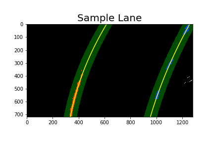  
*Sample Lane without Sliding Window*    

> Results of Lane Detection by skipping sliding window and using prior polynomial   

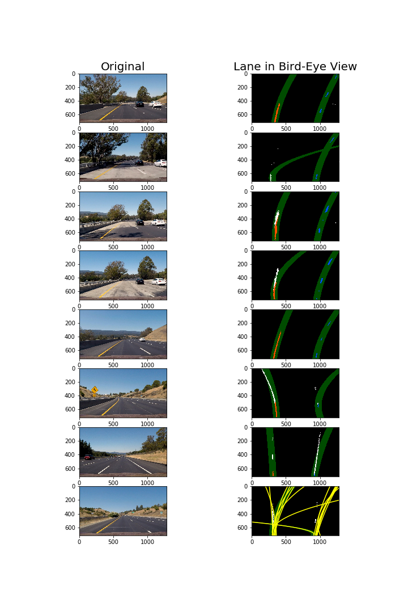  
*Finding Lanes in Sample Images* 

## Measure Curvature

> Define conversions in x and y from pixels space to meters  
ym_per_pix = 30/720 # meters per pixel in y dimension  
xm_per_pix = 3.7/700 # meters per pixel in x dimension  
left_fitx = [lx * xm_per_pix for lx in left_fitx]  
right_fitx = [rx * xm_per_pix for rx in right_fitx]  
ploty = [py * ym_per_pix for py in ploty]  
left_fit = np.polyfit(ploty, left_fitx, 2)  
right_fit = np.polyfit(ploty, right_fitx, 2)  
y_eval = np.max(ploty)  
y_eval = y_eval * ym_per_pix  
A, B, C = left_fit[0], left_fit[1], left_fit[2]  
left_curverad = (((1 + (2 * A * y_eval + B)**2))**1.5) / np.absolute(2*A)    
A, B, C = right_fit[0], right_fit[1], right_fit[2]  
right_curverad = (((1 + (2 * A * y_eval + B)**2))**1.5) / np.absolute(2*A)  

## Measure Centre  

> Consider last 20 Points  
left_fitx = left_fitx[-20:]  
right_fitx = right_fitx[-20:]  
ploty = ploty[-20:]  
diff = [l + (r - l)/2 for r, l in zip(right_fitx, left_fitx)]  
x = np.mean(diff)  
y = np.mean(ploty)  
cx, cy = int(x), int(y)  

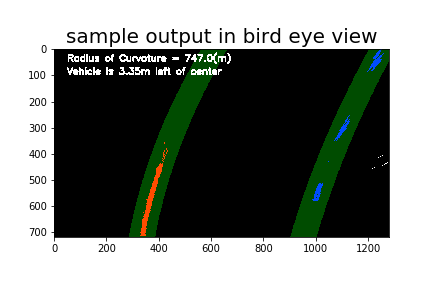  
*Sample output image with Curvature and Centre in Bird Eye View*  

---
# Process Input  
> Complete Pipeline for processing image in Video  
\# Get Binary Thresholded Image and M with bird-eye view  
binary_warped, M = birds_eye(image)  
\# Create Inverse Transform  
Minv = np.linalg.inv(M)  
w, h = image.shape[1], image.shape[0]  
\# Get for left and right polynomial points  
out_image, left_fitx, right_fitx, ploty = search_around_poly(binary_warped, disp_fit=False)  
\# Change Prespective and add to the original image  
out_image = cv2.warpPerspective(out_image, Minv, (w, h))  
result = cv2.addWeighted(image, 1, out_image, 0.3, 0)  
\# Get Curvature and Center if Lane Found i.e. there are points in polynomial   
left_curverad, right_curverad = measure_curvature_real(left_fitx, right_fitx, ploty)  
cx, cy = get_centre(left_fitx, right_fitx, ploty)  

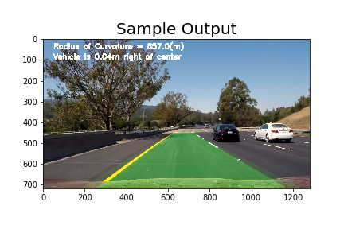  
*Sample output image with Curvature and Centre in Camera View*  

> Process Video  
clip_marked = clip.fl_image(lambda image: process_image(image))  

# Input and Final Output  

Input: [Project Video](data/project_video.mp4)  

Output: [Project Video Marked](data/project_video_marked.mp4)  

