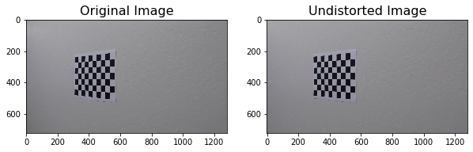
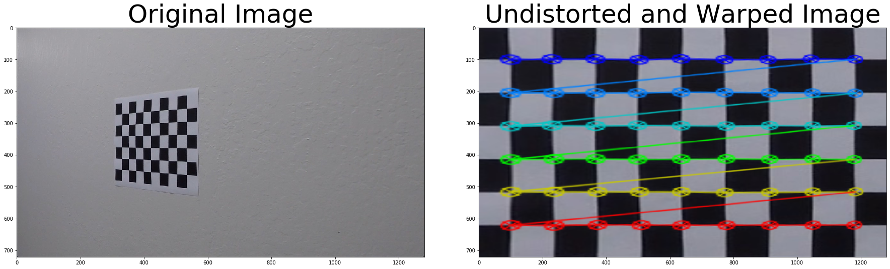
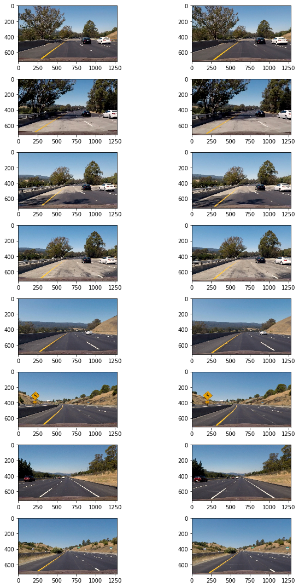
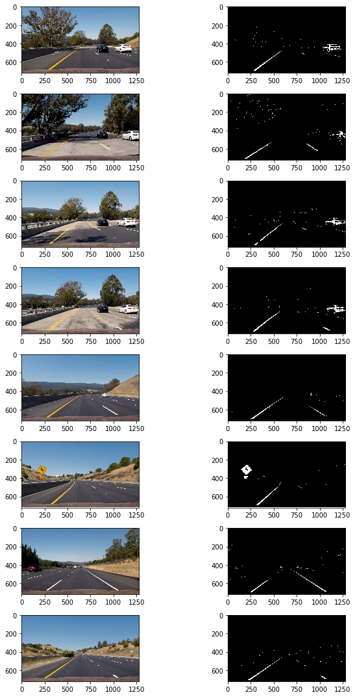
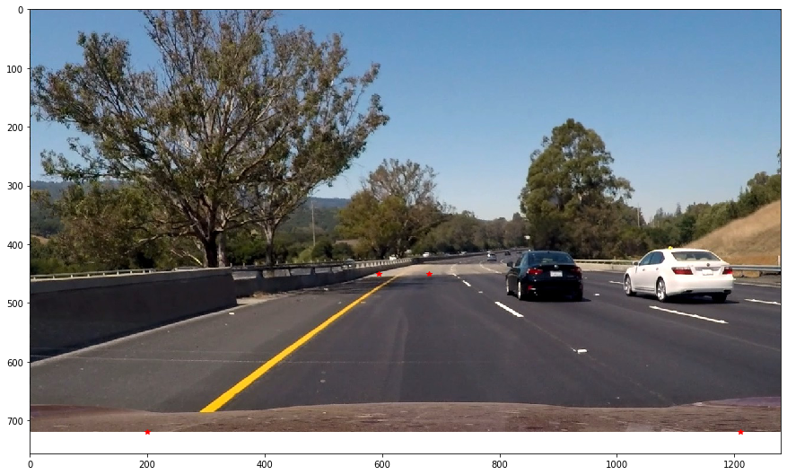
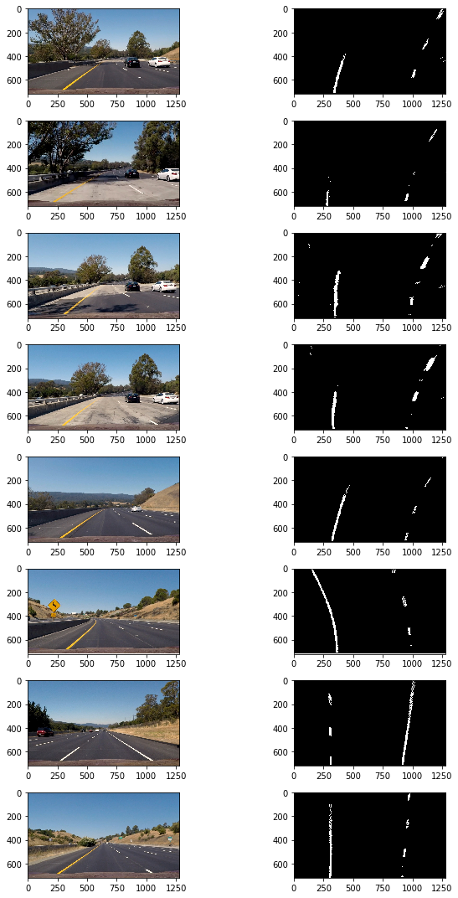
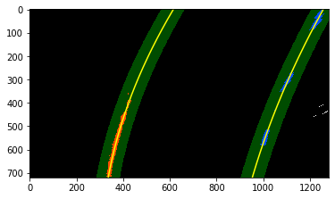
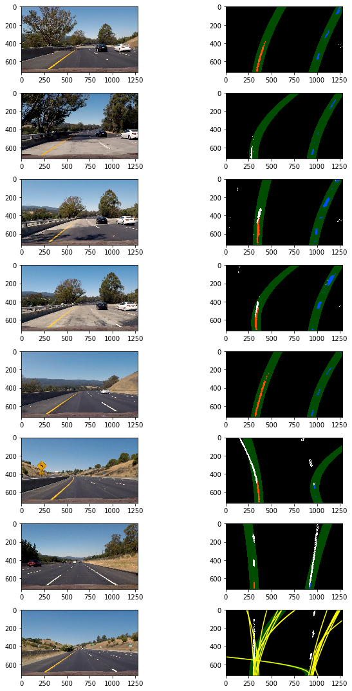
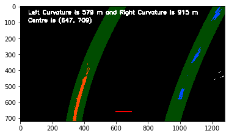
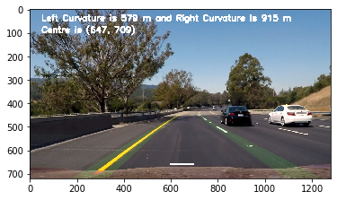

# Advance Lane Lines
> Steps
* Compute the camera calibration matrix and distortion coefficients given a set of chessboard images
* Apply a distortion correction to raw images
* Use color transforms, gradients, etc., to create a thresholded binary image
* Apply a perspective transform to rectify binary image ("birds-eye view")
* Detect lane pixels and fit to find the lane boundary
* Measure Curvature

---
## Compute the camera calibration matrix and distortion coefficients given a set of chessboard images
Camera introduces two types of distortation:
* Radial Distortion
    * Real cameras use curved lenses to form an image, and light rays often bend a little too much or too little at the edges of these lenses. This creates an effect that distorts the edges of images, so that lines or objects appear more or less curved than they actually are. This is called radial distortion, and it’s the most common type of distortion.
* Tangential Distortion
    * This occurs when a camera’s lens is not aligned perfectly parallel to the imaging plane, where the camera film or sensor is. This makes an image look tilted so that some objects appear farther away or closer than they actually are.
    
* Distortion can be corrected with following Coefficients and Correction
    * radial distortion: k1, k2, and k3
    * tangential distortion: p1 and p2
    
In order to calibrate camera, following 20 images were used.
 
*Calibration Images for Object Points for 9 inside corners on x-axis and 6 inside corners on y-axis with z-value zero *

Following process explains Calibration Steps

> Get Object Points  
objp = np.zeros((6*9, 3), np.float32)  
mat = np.mgrid[0:9, 0:6]  
mat = mat.T  
mat = mat.reshape(-1, 2)  
objp[:, :2] = mat   

> Image Points  
gray = cv2.cvtColor(image, cv2.COLOR_BGR2GRAY)  
ret, corners = cv2.findChessboardCorners(gray, (nx, ny), None)  
imgpoints.append(corners)  
objpoints.append(objp)  

> Calibrate to calculate distortion coefficients  
ret, mtx, dist, rvecs, tvecs = cv2.calibrateCamera(objpoints, imgpoints, image_size, None, None)  
*save mtx and dist to be used later for all images  

>  Test undistortion on an image  
undist = cv2.undistort(image, mtx, dist, None, mtx)  

  
*Sample Undistorted Image*

> Transform Perspective  
gray = cv2.cvtColor(undist, cv2.COLOR_BGR2GRAY)  
ret, corners = cv2.findChessboardCorners(gray, (nx, ny), None)  

> Get Source Points from Corners  
top_left, top_right = corners[0], corners[nx-1]  
bottom_right, bottom_left = corners[-1], corners[-nx]  
src = np.float32([top_left, top_right, bottom_right, bottom_left])  

> Get Destination Points from Image with offset e.g. 300  
top_left, top_right = [offset, offset], [image_size[0] - offset, offset]    
bottom_right = [image_size[0] - offset, image_size[1] - offset]    
bottom_left = [offset, image_size[1] - offset]  
dst = np.float32([top_left, top_right, bottom_right, bottom_left])  

> Perspective transform matrix  
M = cv2.getPerspectiveTransform(src, dst)

> Get Warped Image  
warped = cv2.warpPerspective(undist, M, image_size)  

  
*Sample Undistorted and Warped Image*  

---
## Apply a distortion correction to raw images

> Process to Undistort Images  
dist_pickle = pickle.load(open(dist_fname, 'rb'))  # Load Calibration Params    
mtx = dist_pickle['mtx']  
dist = dist_pickle['dist']  
image = cv2.undistort(image, mtx, dist, None, mtx) # Undistort  Images  

  
*Images Undistorted*  

---
## Use color transforms, gradients, etc., to create a thresholded binary image.
* Process steps to create thresholded binary images are below

> Undistort Image  
image = cv2.undistort(image, mtx, dist, None, mtx)   

> Threshold R color channel to get R Binary with (200, 255)  
R = image[:,:,0]  
R_binary = np.zeros_like(R)  
R_binary[(R >= R_thresh[0]) & (R <= R_thresh[1])] = 1  

> Threshold color channel with (170, 255) to get s_binary  
hls = cv2.cvtColor(image, cv2.COLOR_RGB2HLS)  
s_channel = hls[:, :, 2]  
s_binary = np.zeros_like(s_channel)  
s_binary[(s_channel >= s_thresh[0]) & (s_channel <= s_thresh[1])] = 1  

> Threshold x gradient with (20, 100) to get sx_binary  
l_channel = hls[:, :, 1]  
\# Apply Sobel x  
sobelx = cv2.Sobel(l_channel, cv2.CV_64F, 1, 0)  
sobelx_abs = np.absolute(sobelx)  
scale_factor = np.max(sobelx_abs) / 255  
scaled_sobel = np.uint8(sobelx_abs/scale_factor)  
\# Threshold x gradient  
sx_binary = np.zeros_like(scaled_sobel)  
sx_binary[(scaled_sobel >= sx_thresh[0]) & (scaled_sobel <= sx_thresh[1])] = 1   

> Activate binary image when any two activated from R_binary, s_binary, or sx_binary  
combined_binary = np.zeros_like(sx_binary)  
opt1 = (s_binary == 1) & (sx_binary == 1)  
opt2 = (sx_binary == 1) & (R_binary == 1)    
opt3 = (s_binary == 1) & (R_binary == 1)  
opt = opt1 | opt2 | opt3  
combined_binary[opt] = 1   

  
*Threshold Binary Images*  

## Apply a perspective transform to rectify binary image ("birds-eye view").
 
*Object Points Marked on Sample Image with Red Star for Bird-Eye View*

 
*Threshold Binary Images from Bird-Eye View*

## Detect lane pixels and fit to find the lane boundary
 
*Lane Detection using Sliding Window*

 
*Sample Lane without Sliding Window*

 
* Finding Lanes in Sample Images 

## Measure Curvature
 
*Sample output image with Curvature and Centre in Bird Eye View*

 
*Sample output image with Curvature and Centre in Camera View*

# Input and Final Output

Input: [Project Video](data/project_video.mp4)

Output: [Project Video Marked](data/project_video_marked.mp4)

