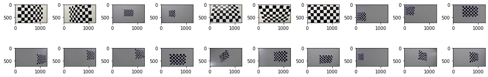

# Advance Lane Lines

* Compute the camera calibration matrix and distortion coefficients given a set of chessboard images
* Apply a distortion correction to raw images
* Use color transforms, gradients, etc., to create a thresholded binary image
* Apply a perspective transform to rectify binary image ("birds-eye view")
* Detect lane pixels and fit to find the lane boundary
* Measure Curvature

## Compute the camera calibration matrix and distortion coefficients given a set of chessboard images
* https://github.com/naneja/advance-lane-lines/blob/master/images/calibration.png

## Apply a distortion correction to raw images

## Use color transforms, gradients, etc., to create a thresholded binary image.

## Apply a perspective transform to rectify binary image ("birds-eye view").

## Detect lane pixels and fit to find the lane boundary

## Measure Curvature
